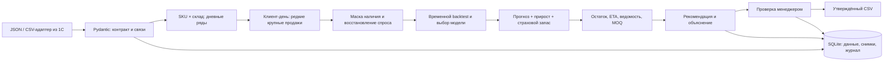

# Контур · HACKALEM AI × Электрокомплект

Рабочий локальный прототип автоматического пополнения склада. Менеджер выбирает склад и категорию, получает рекомендации с формулой и прогнозом, меняет количества, утверждает заказ и выгружает CSV.

**Добавлены реальные примеры IEK и Systeme Electric.** Стартовая страница «Данные партнёров» работает с двумя предоставленными архивами: каталог, месячный ML-прогноз, проверка качества, ручное дополнение входов и CSV. Устройство файлов, обязательные поля, фактические метрики и ограничения описаны отдельно в [паспорте данных IEK × Systeme](README_PARTNER_DATA_IEK_SYSTEME_2026.md). Архивы и база локальные, в Git не входят; инструкция импорта — в паспорте.

Дневной сценарий «Демо · обзор закупок» использует **синтетические данные** и отдельную базу. Описанная ниже дневная методология относится к нему; месячный алгоритм партнёрских отчётов описан в отдельном паспорте. Система ничего не отправляет поставщикам.

## Запуск за несколько минут

Проверено на **Python 3.14, Node.js 24, macOS arm64**. `requirements.lock` и `package-lock.json` фиксируют проверенные зависимости.

```bash
cd hack-c111d790-daa
make install
make build
make api
```

Открыть **http://127.0.0.1:8000**. API: **http://127.0.0.1:8000/docs**. При первом запуске автоматически создаются демоданные и SQLite в `data/ekt.sqlite3`. Ключи внешних API не нужны. После установки приложение работает без внешних сервисов и без загрузки шрифтов из сети.

Для разработки: в одном терминале `make api`, во втором `make dev`; интерфейс доступен на http://127.0.0.1:5173 с прокси `/api` на Python. После изменения backend перезапустите его; можно добавить `--reload`. После production-сборки перезапустите API, чтобы подключить `dist`.

Альтернатива — `docker compose up --build`. Порт опубликован только на localhost, данные сохраняются в volume. Docker-конфигурация предоставлена, но сборка контейнера в текущей среде не проверялась.

## Почему такой стек и архитектура

| Слой | Реализация | Причина |
|---|---|---|
| UI | React, TypeScript, Vite, Recharts, Lucide | Таблица заказов, графики, фильтры, формы и сценарии без перезагрузки |
| API и контракты | FastAPI, Pydantic | Валидация всех источников, OpenAPI, понятные ошибки импорта |
| Прогноз | NumPy, scikit-learn Huber + статистические модели | Обучение на CPU, работа на небольших выборках, прозрачные baseline и воспроизводимость |
| Закупки | Отдельный детерминированный модуль | Модель прогнозирует спрос; бизнес-правила превращают его в заказ |
| Хранение | SQLite WAL | Один локальный процесс, неизменяемые снимки расчётов, транзакционное утверждение |
| Качество | pytest, Ruff, TypeScript, Prettier, CI | Проверка бизнес-свойств, контракта и воспроизводимого backtest |

**Модульный монолит** позволяет быстро показать полный сценарий и проверять алгоритм отдельно от UI. Очереди, микросервисы и GPU пока не добавляют качества расчёту. Для реальной эксплуатации логичные следующие шаги — PostgreSQL, фоновые задания и доступ по ролям, когда появятся реальные объёмы и несколько пользователей.



LLM не участвует в вычислении количеств. Обоснование формируется из сохранённых слагаемых, поэтому его можно пересчитать. Позже можно добавить диалоговый интерфейс поверх read-only инструментов, сохранив формулу и утверждение на сервере.

## Что реализовано

- Расчёт по SKU × склад; фильтрация по складу и категории.
- История, остатки, поступления с ETA, политика категории, ручной прирост, материальная ведомость.
- Годовая/недельная сезонность и тренд, выбор модели по временным срезам.
- Выделение редких крупных продаж, включая несколько накладных одному клиенту за день.
- Оценка упущенного спроса в дни отсутствия и исключение таких дней из обучающих наблюдений.
- Страховой запас, MOQ, упаковки, риск дефицита до прихода нового заказа.
- Группировка по поставщикам; формула, график и метрики по каждой позиции.
- Сценарии изменения прироста, периода пересмотра и сервиса.
- Редактирование количеств, явное утверждение, защита от повторного утверждения, журнал действий.
- Импорт JSON, CSV-адаптер, экспорт CSV с UTF-8 BOM и разделителем `;`.

## Методология

### 1. Подготовка ряда и аномалии

Единица расчёта — **SKU × склад × день**. `as_of` — первый прогнозируемый день, история включает `[history_start, as_of)`. День без продажи при наличии товара означает нулевой спрос. Дни stockout считаются цензурированными наблюдениями.

Накладные агрегируются по клиенту за день внутри SKU × склад. Порог большой продажи:

```text
threshold = max(8 × median,
                median + 8 × 1.4826 × MAD,
                4 × P90,
                10)
```

Продажа выше порога исключается, если у клиента не более `max(3, floor(train_days / 90))` таких дней в обучающем интервале. Регулярные крупные покупки сохраняются. При менее 14 клиент-днях правило не применяется. Выбросы не удаляются из исходного набора: остаются дата, обезличенный клиент, количество и причина исключения.

Это консервативная эвристика: акция или новый крупный постоянный клиент могут быть ошибочно признаны проектом. Порог и частотный критерий нужно калибровать с закупщиками. Автоматического понимания назначения заказа модель не обещает.

### 2. Кандидаты прогноза

1. **Huber regression:** линейное время, индикаторы дня недели, две гармоники годовой сезонности; годовые признаки включаются при истории от 400 дней. Huber снижает влияние оставшихся выбросов. Отрицательные прогнозы обрезаются до нуля, экстремальные ограничиваются относительно P95 обучающих значений.
2. **Недельный профиль:** среднее доступных дней соответствующего дня недели за последние 56 дней.
3. **Среднее:** последние 56 дней с наличием.
4. **Croston SBA:** отдельное сглаживание размера ненулевого спроса и интервала, `alpha = 0.15`. При >60% нулей в доступных днях обучающего префикса выбираем между SBA и средним, чтобы регрессия не сводила редкий спрос к нулю.

Stockout-дни исключены из обучения. После выбора модели спрос на них восстанавливается моделью, не ниже наблюдённых продаж. Для расчёта запаса используется прогноз, обученный на днях наличия, поэтому дефицит не снижает среднее механически. Восстановление в истории — оценка, а не наблюдённая истина.

### 3. Оценка без утечки будущего

При истории от 168 дней:

- Два expanding-window среза: обучающий префикс до `n−84` и до `n−56`, каждый с проверкой на следующих 28 днях.
- Модель выбирается по среднему MAE этих срезов.
- Последние 28 дней — отдельный holdout, не используемый для выбора модели.
- Порог выбросов и частота крупных заказов для каждого среза считаются только на его обучающем префиксе.
- В holdout оцениваются только дни наличия; проектные продажи исключаются порогом префикса. Это метрика **регулярного спроса после эвристической очистки**, а не всех фактических отгрузок.
- После оценки выбранная модель переобучается на всей доступной истории для будущего прогноза.

При 84–167 днях используется среднее, с отдельным holdout. При меньшей истории метрики недоступны; UI показывает `—`. Для отсутствующей/полностью недоступной истории нулевой прогноз помечается как ограниченный и требует ручного решения.

```text
WAPE = Σ|y − ŷ| / Σy × 100%
MAE  = mean(|y − ŷ|)
Bias = Σ(ŷ − y) / Σy × 100%
```

Если сумма фактического спроса нулевая, WAPE/Bias не определены. Основная карточка показывает **WAPE по закупочной стоимости**: `Σ(price_SKU × |y − ŷ|) / Σ(price_SKU × y)`. Все слагаемые выражены в тенге, поэтому метры и штуки не смешиваются. Это ошибка прогноза, взвешенная по стоимости, а не измеренный финансовый ущерб. Дополнительно показываются **невзвешенное среднее WAPE по SKU × склад** и каждая позиция отдельно; малые знаменатели редкого спроса могут сильно повышать среднее. Baseline — сырое среднее предыдущих 56 календарных дней на том же holdout. Он намеренно показывает исходный подход без очистки; отдельные очищенные простые модели также участвуют в выборе.

### 4. Прогноз → закупка

```text
H = срок поставки + период пересмотра
growth = (1 + прирост_SKU/100) × (1 + сценарий/100)
D = Σ прогноз_дня × growth, на H дней
SS = ceil(z(service_level) × RMSE_holdout × growth × sqrt(H))
need = max(0, D + SS + дополнительная_ведомость − остаток − поступления_в_горизонте)
Q = 0, если need = 0
Q = ceil(max(need, MOQ) / pack_size) × pack_size, иначе
```

Без доступного holdout RMSE заменяется стандартным отклонением очищенных дней наличия. Формула SS предполагает независимые дневные ошибки и приближённую нормальность суммарной ошибки. Целевой уровень сервиса — параметр политики, **не измеренная гарантия**. Коррелированные ошибки, нестабильный lead time и редкий спрос требуют последующей калибровки по ошибкам сумм спроса на реальном горизонте поставки.

Интервал на графике использует P90 абсолютных ошибок holdout (при нехватке — `1.645 × sigma`), без гарантии покрытия. Средние по неделям на графике служат для чтения; расчёт выполняется по дням.

Поступления учитываются при `as_of <= ETA < as_of + H`. Просроченные исключаются до уточнения даты, более поздние показываются отдельно. Дневной баланс выявляет нехватку до прибытия нового заказа даже при достаточном общем количестве в пути. Такой риск требует ускорения или перемещения; обычный заказ не может устранить уже близкий дефицит.

`materials` — **дополнительная, ещё не исполненная потребность**, которая не включена в регулярный прогноз и не вычтена из передаваемого остатка. Потребность с прошедшим сроком относится к первому дню. Потребность после горизонта пока не заказывается. Этот договор об остатках и резервах обязательно согласовать с учётом 1С, чтобы исключить двойной счёт.

## Входные данные и 1С

Полная схема: `GET /api/dataset/schema`; пример: «Источники данных → Скачать JSON» или:

```bash
make demo
python -m scripts.dataset to-csv --input data/demo.json --output data/csv-example
python -m scripts.dataset from-csv --input data/csv-example --output data/import.json
```

Команды `python` запускайте из активированной `.venv`, либо замените на `.venv/bin/python`.

| Таблица | Основные поля |
|---|---|
| `sales` | `date, sku, warehouse, quantity, price, client_id` |
| `inventory` | `sku, warehouse, on_hand` — единственный снимок на `as_of` |
| `stockouts` | `sku, warehouse, start, end` — включительно |
| `inbound` | `sku, warehouse, quantity, eta` — открытые подтверждённые поставки |
| `products` | `sku, name, category_id, supplier_id, unit, purchase_price, pack_size, moq, growth_pct` |
| `categories` | `id, name, service_level, review_days` |
| `suppliers` | `id, name, lead_days` |
| `materials` | `sku, warehouse, quantity, due_date, reference` |

`manifest.json` содержит `schema_version: "1.0"`, `name`, `synthetic`, `as_of`, `history_start`. CSV-адаптер ожидает имена колонок из схемы, UTF-8 (BOM допустим), `;`, ISO-даты и десятичную точку. Источник не должен дублировать накладные: контракт не содержит уникальный ID транзакции для дедупликации. Возвраты/отрицательные отгрузки нужно нормализовать отдельно.

Лимиты прототипа: запрос до 32 МБ, до 250 000 строк продаж, до 1000 SKU, история 28–3650 дней. Это ограничения приёма, **не заявленная нагрузочная производительность**; benchmark измеряет демонабор.

Выходной CSV: UTF-8 BOM, `;`, десятичная запятая, статус, артикул, склад, поставщик, количество, единица, закупочная цена, сумма, приоритет, обоснование, комментарий, ID расчёта. Формулы в текстовых ячейках экранируются. **CSV готов для настройки обмена; универсальная совместимость с конкретной конфигурацией 1С не подтверждена.** Отчёт V2 партнёра пока не получен, поэтому точный mapping колонок, единиц и резервов остаётся задачей интеграции.

## Проверка и воспроизводимость

```bash
make test
make lint
make build
make benchmark
```

`reports/benchmark.json` — фактически рассчитанные метрики для 24 позиций SKU × склад, seed 42, два года истории. Экономия, сокращение дефицита и прибыль не симулируются и не выдаются за измеренный эффект. Для реальных данных: `python -m scripts.evaluate --input data/import.json --output reports/partner.json`.

| Обязательное условие | Где реализовано | Что проверяет тест |
|---|---|---|
| Все источники влияют на расчёт | `planning.py` | Изменение продаж, остатка, inbound, роста, категории, срока и ведомости меняет заказ |
| Сезонность и устойчивый рост | `forecasting.py` | Сезонная синусоида + тренд воспроизводятся прогнозом |
| Упущенный спрос | Маска наличия | Добавление stockout восстанавливает спрос и увеличивает потребность |
| Крупная продажа одному клиенту | `clean()` | Пять накладных проекта не меняют регулярный заказ; повторяющийся крупный клиент сохранён |
| Поставщик и объяснение | `planning.py`, UI | Группы, суммы, формула и складская изоляция |
| Ручное утверждение | `main.py`, `storage.py` | Нет утверждения без флага; MOQ, дубли, конфликт повторного утверждения; CSV с изменённым количеством |
| Нет утечки holdout | `forecasting.py` | Изменение последнего периода не меняет tuning-оценки и выбранную модель |

CI запускает те же проверки и сохраняет benchmark как артефакт. UI проходит TypeScript-проверку и production-сборку. Обновлённый обзор с белыми карточками, фиолетово-синей палитрой и диаграммой состояния запасов визуально проверен в Chrome. Автоматические браузерные тесты в текущую поставку не входят.

## Структура репозитория

```text
backend/
  schemas.py       # входные модели и проверка связей
  demo.py          # воспроизводимые синтетические данные
  forecasting.py   # очистка, модели, временные срезы, восстановление
  planning.py      # закупочная политика, ETA, объяснения
  storage.py       # SQLite, снимки, журнал и атомарное утверждение
  main.py          # API и раздача production UI
frontend/
  App.tsx          # рабочее место закупщика
  Chart.tsx        # история, прогноз и ориентир неопределённости
  StockOverview.tsx # сегментированная диаграмма статусов запаса
  api.ts           # клиент API и ошибки
  types.ts         # типы результатов
  styles.css       # адаптивный интерфейс
scripts/
  dataset.py       # генерация и CSV-адаптер
  evaluate.py      # benchmark на демо или JSON-наборе
tests/             # проверки бизнес-свойств и интеграции
reports/           # воспроизводимый результат benchmark
```

## Ограничения и следующий этап

Это **локальный однопользовательский прототип**. Отсутствуют SSO/RBAC, идентификация реального утвердившего сотрудника, миграции БД, очереди, мониторинг дрейфа и автоматический импорт из 1С. Префикс `anon_` и запрет лишних полей проверяют формат, но не доказывают анонимность: её обеспечивает источник. Продажи и снимки хранятся локально, в Git не попадают. Не публикуйте API в интернет без аутентификации и защиты данных.

Для усиления технической защиты проекта после получения данных:

1. Согласовать договор о доступных остатках, резервах, stockout, новинках, возвратах и сроках поставки.
2. Разметить проекты и повторяющиеся крупные продажи; измерить precision/recall очистки.
3. Провести rolling backtest на нескольких сезонах, добавить стоимость ошибки и симуляцию запасов с фактическими lead time.
4. Сравнить текущие модели с глобальным CatBoost/LightGBM по всем SKU, с признаками категории и лагами, используя тот же временной протокол.
5. Калибровать интервалы по суммарному спросу на lead time, проверить фактический service level и влияние MOQ на излишки.
6. Подключить контракт V2/1С, PostgreSQL, фоновые задания, авторизацию и именной аудит.

Материалы по применённым библиотекам: [FastAPI и валидация](https://fastapi.tiangolo.com/features/), [HuberRegressor](https://scikit-learn.org/stable/modules/generated/sklearn.linear_model.HuberRegressor.html), [временная cross-validation](https://scikit-learn.org/stable/modules/cross_validation.html#time-series-split).
